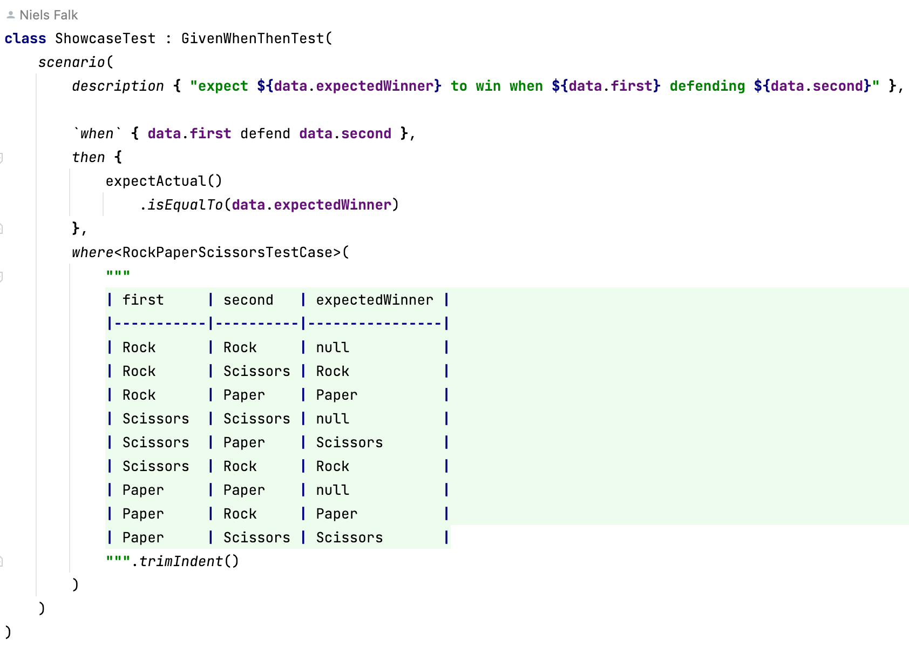

# GivenWhenThen

[](https://jitpack.io/#nielsfalk/givenWhenThen)


provides [Spock](https://spockframework.org/)syntax with tabular testdata in [Kotlin](https://kotlinlang.org/) with [JUnit](https://junit.org/junit5/) and [Strikt](https://strikt.io/)-assertions.


## Example

A Dsl is provided so Testcode can look like this

```kotlin
class RockPaperScissorsTest : GivenWhenThenTest(
    scenario(
        description {
            "Rock Paper Scissors expectedWinner=${data.expectedWinner}"
        },
        `when` { data.first defend data.second },
        then {
            expectActual()
                .isEqualTo(data.expectedWinner)
        },
        where<RockPaperScissorsTestCase> {
            // @formatter:off
            Rock     ǀ Rock     ǀǀ null
            Rock     ǀ Scissors ǀǀ Rock
            Rock     ǀ Paper    ǀǀ Paper
            Scissors ǀ Scissors ǀǀ null
            Scissors ǀ Paper    ǀǀ Scissors
            Scissors ǀ Rock     ǀǀ Rock
            Paper    ǀ Paper    ǀǀ null
            Paper    ǀ Rock     ǀǀ Paper
            Paper    ǀ Scissors ǀǀ Scissors
            // @formatter:on
        }
    )
)

private data class RockPaperScissorsTestCase(
    val first: RockPaperScissors,
    val second: RockPaperScissors,
    val expectedWinner: RockPaperScissors?
)
```

It looks even cooler in IntelliJ



Other examples can be found [here](https://github.com/nielsfalk/givenWhenThen/tree/master/src/test/kotlin/de/nielsfalk/givenwhenthen/example)


## Dsl

The Dsl is inspired by [Spock](https://spockframework.org/).
What makes [Spock](https://spockframework.org/) stand out from the crowd is its beautiful and highly expressive specification language.


## Getting started

Add the following to your ```build.gradle.kts```

```kotlin
repositories {
    maven { setUrl("https://jitpack.io") }
}

dependencies {
    testImplementation("com.github.nielsfalk:givenWhenThen:0+")
    implementation("io.strikt:strikt-core:0.34.1")
}
```

or follow the Instructions on [jitpack](https://jitpack.io/#nielsfalk/givenWhenThen)

and write your first Test

```kotlin
import de.nielsfalk.givenwhenthen.*

class FirstTest : GivenWhenThenTest(
    scenario(
        description { "first test" },

        given { },
        `when` { },
        then { expectActual().isEqualTo(Unit) },
        where(Unit)
    )
)
```

[<div align="right"></div>](https://kotlinlang.org/docs/kotlin-mascot.html)

## Power-Assertions

The [Spockframework](https://spockframework.org/) is also known for its Power-Assertions.

When a Power-Assertion like this ...
```
expect {
    data.run { assert(first defend second != expectedWinner) }
}
```
... fails, you get the following error message:

```
Assertion failed
assert(first defend second != expectedWinner)
       |     |      |      |  |
       |     |      |      |  null
       |     |      |      |  RockPaperScissorsTestCase(first=Rock, second=Rock, expectedWinner=null)
       |     |      |      false
       |     |      Rock
       |     |      RockPaperScissorsTestCase(first=Rock, second=Rock, expectedWinner=null)
       |     null
       Rock
       RockPaperScissorsTestCase(first=Rock, second=Rock, expectedWinner=null)
```

Power-Assertions can be achieved by setting up [kotlin-power-assert](https://github.com/bnorm/kotlin-power-assert) in your project.
