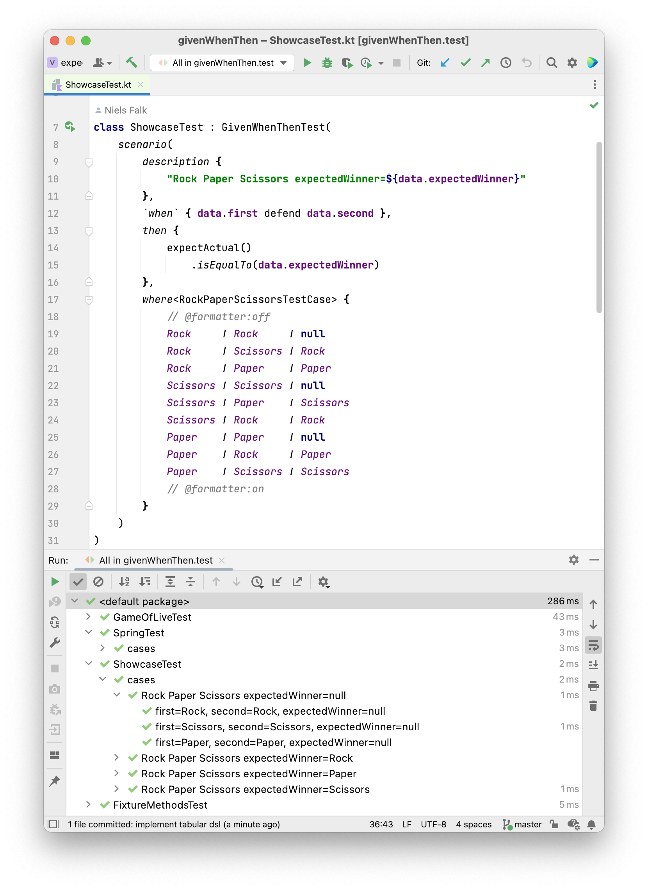

# GivenWhenThen

provides [Spock](https://spockframework.org/)syntax in [Kotlin](https://kotlinlang.org/) with [JUnit](https://junit.org/junit5/), [Strikt](https://strikt.io/)-assertions and testdata defined in markdown.


## Example

A Dsl is provided so Testcode can look like this

```kotlin
class ShowcaseTest : GivenWhenThenTest(
    scenario(
        description { "Rock Paper Scissors expectedWinner=${data.expectedWinner}" },

        `when` { data.first defend data.second },
        then {
            expectActual()
                .isEqualTo(data.expectedWinner)
        },
        where<RockPaperScissorsTestCase>(
            """
            | first     | second   | expectedWinner |
            |-----------|----------|----------------|
            | Rock      | Rock     | null           |
            | Rock      | Scissors | Rock           |
            | Rock      | Paper    | Paper          |
            | Scissors  | Scissors | null           |
            | Scissors  | Paper    | Scissors       |
            | Scissors  | Rock     | Rock           |
            | Paper     | Paper    | null           |
            | Paper     | Rock     | Paper          |
            | Paper     | Scissors | Scissors       |
            """.trimIndent()
        )
    )
)

private data class RockPaperScissorsTestCase(
    val first: RockPaperScissors,
    val second: RockPaperScissors,
    val expectedWinner: RockPaperScissors?
)
```

It looks even cooler, when the markdown-table is syntax-highlighted by IntelliJ



Other examples can be found [here](https://github.com/nielsfalk/givenWhenThen/tree/master/src/test/kotlin/de/nielsfalk/givenwhenthen/example)


## Dsl

The Dsl is inspired by [Spock](https://spockframework.org/).
What makes [Spock](https://spockframework.org/) stand out from the crowd is its beautiful and highly expressive specification language. 